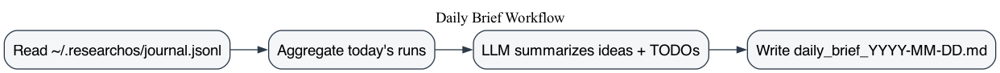

# Daily Research Brief

Summarizes your ResearchOS activity for the day into a brief research journal.

**Command**
```bash
researchos --daily-brief
```
## Workflow



**Output**
- `outputs/daily_brief_YYYY-MM-DD.md`

**Includes**
- Papers read today
- Ideas explored
- TODOs inferred from your runs

**Notes**
- The brief is generated from a local journal stored at `~/.researchos/journal.jsonl`.
- The journal is updated automatically on each run (slides or non-slide modes).
